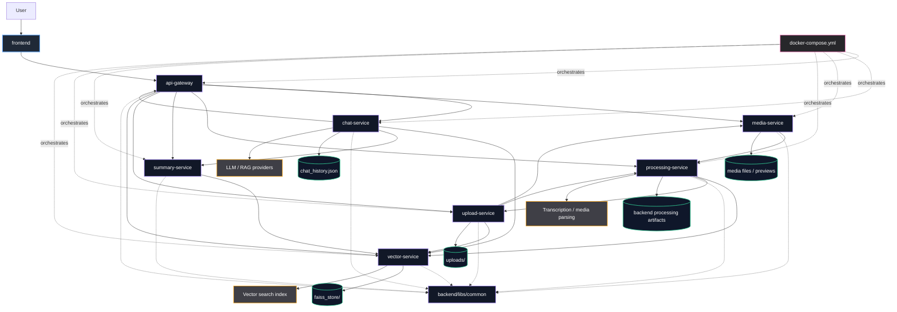

# Sutr Project Architecture

## Notes

- `frontend` is shown as a single client block, per request.
- `api-gateway` routes requests to the domain services.
- `chat-service` coordinates retrieval and response generation through the vector store and summary layer.
- `upload-service` handles file ingress and hands work off to processing and media flows.
- `processing-service` prepares content for downstream retrieval and analysis.
- `vector-service` owns similarity search and FAISS-backed indexing.
- `summary-service` produces condensed outputs for document summaries.
- `media-service` manages media-oriented access and playback related operations.
- `backend/libs/common` contains shared configuration and response helpers used across services.
- `docker-compose.yml` orchestrates the full local stack.
